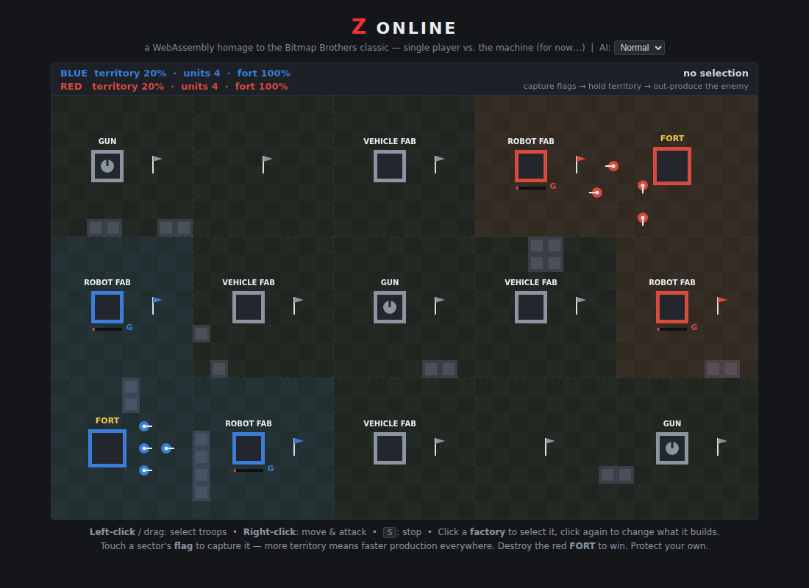

# Z Online

**A WebAssembly homage to *Z* — the 1996 real-time strategy classic by The Bitmap Brothers.**

Two robot armies. One map carved into sectors. No harvesting, no base building —
just flags, factories, and firepower. Touch a sector's flag to own it; every
sector you hold makes **all** of your factories produce faster. Destroy the
enemy fort before yours falls.



> **Current status: Phase 1 — single player vs. the PC.**
> This build pits you against a built-in AI opponent, entirely in your browser.
> It is the foundation for something much bigger: **web-based multiplayer** is
> next, and the long-term goal is a **persistent, massive-scale online world**.
> See the [Roadmap](docs/ROADMAP.md) for where this is going.

## Play

The game is a static site — no server logic, no dependencies. Serve the `web/`
directory with any static file server and open it in a browser:

```sh
python3 -m http.server -d web 8000
# then open http://localhost:8000
```

(A plain `file://` open won't work because browsers refuse to `fetch()` the
`.wasm` module from disk.)

### Controls

| Input | Action |
|---|---|
| Left-click / drag | Select your units (box select) |
| Right-click | Move / attack-move selected units |
| `S` | Stop selected units |
| Click a factory | Select it (shows what it's building) |
| Click it again | Cycle what it manufactures |

### How to win

- **Capture flags.** Stand a unit next to a sector's flag for a few seconds to
  raise your colors. The sector — and any factory or gun inside it — is yours.
- **Territory is the economy.** There is no money and no mining. The more of
  the map you hold, the faster *every* factory you own builds units.
- **Guns are terrain.** Fixed gun turrets belong to whoever owns their sector.
  A well-placed capture flips a gun from shredding you to shielding you.
- **Kill the fort.** Reduce the red FORT to rubble and the map is yours.
  Lose your own and it's over.

Units fight autonomously, just like in Z: they acquire targets, shoot on the
move, and pick fights with anything that wanders into range — your job is
strategy, not babysitting.

### Roster

| Unit | Built by | Character |
|---|---|---|
| Grunt | Robot Fab | Cheap, fast to build, dies in droves |
| Psycho | Robot Fab | Faster trigger finger |
| Tough | Robot Fab | Slow, hits hard, soaks damage |
| Sniper | Robot Fab | Fragile, outranges almost everything |
| Jeep | Vehicle Fab | Fast harasser and flag-grabber |
| Light Tank | Vehicle Fab | The workhorse |
| Heavy Tank | Vehicle Fab | Slow, expensive, ends arguments |

Three AI difficulty levels (Easy / Normal / Hard) are selectable above the
canvas — they change how quickly the machine reacts, expands, and decides to
storm your fort.

## Build from source

The entire simulation is a single freestanding C file compiled straight to
`wasm32` with stock clang — **no Emscripten, no libc, no npm build step**:

```sh
./build.sh          # needs clang + wasm-ld (LLVM 15+)
```

This produces `web/game.wasm` (~25 KB). The JavaScript in `web/main.js` is
only a host: it forwards pointer/keyboard input into the module, steps the
simulation each animation frame, and rasterizes the module's primitive
draw-command buffer onto a `<canvas>`.

```
┌────────────────────────────┐      ┌─────────────────────────────┐
│  web/main.js (host)        │      │  src/game.c → game.wasm     │
│  input events  ────────────┼─────▶│  simulation: sectors, flags │
│  tick(dt) each rAF ────────┼─────▶│  units, A* pathfinding,     │
│  render() ◀────────────────┼──────│  combat, production, AI     │
│  draws command buffer      │      │  (static memory, no libc)   │
└────────────────────────────┘      └─────────────────────────────┘
```

This split is deliberate: the sim core knows nothing about the DOM, the
canvas, or even time — it just consumes commands and produces state. That is
exactly the shape a lockstep multiplayer client needs (see the roadmap).

### Tests

A headless smoke test runs the module under Node — boots a game, feeds it
scripted input, simulates several minutes, and checks the sim progresses and
terminates:

```sh
node tests/smoke.mjs
```

## Repository layout

```
src/game.c        the whole game: sim, AI, pathfinding, render commands
web/index.html    page shell, HUD chrome, difficulty picker
web/main.js       wasm host: loop, input, canvas rasterizer
web/game.wasm     prebuilt module (rebuild with ./build.sh)
tests/smoke.mjs   headless Node smoke test
docs/ROADMAP.md   where this project is going — multiplayer & beyond
build.sh          one-command clang build
```

## The bigger picture

This repository is **ZZZonline**, and the "online" is not decorative. The
plan, in three acts:

1. **Now — vs. the PC.** A complete, playable single-player Z experience in
   WebAssembly. Prove the sim, the feel, and the toolchain.
2. **Next — web multiplayer.** Deterministic lockstep over WebRTC/WebSockets:
   two humans, one map, the same 25 KB sim running on both ends. The
   single-player AI becomes a drop-in stand-in for a disconnected opponent.
3. **Eventually — the persistent world.** One enormous, always-on planet of
   thousands of sectors where hundreds of players fight over a front line that
   never resets. Massive scale is the endgame — sharded sector simulation,
   spectating, alliances, and a war that outlives any single session.

Full details, architecture sketches, and milestones: **[docs/ROADMAP.md](docs/ROADMAP.md)**.

## Credits

*Z* was created by The Bitmap Brothers (1996). This project is an independent
fan homage that reimplements the core mechanics from scratch — it contains no
original assets or code, and is not affiliated with or endorsed by the rights
holders.
